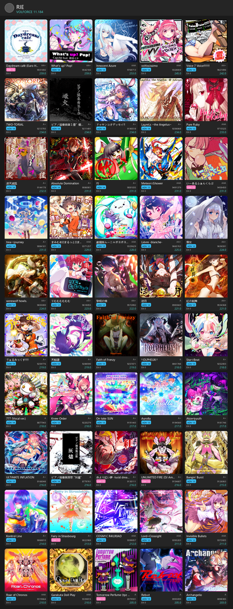

# SDVX B50 Generator

> BEMANI 音乐游戏 **SOUND VOLTEX EXCEED GEAR / ∇** 的 Best 50 成绩卡片生成器。

从 [asphyxia]([https://github.com/asphyxia-core/asphyxia](https://github.com/asphyxia-core))存档中提取玩家成绩，按 **VOLFORCE** 降序取前 50 个不同谱面，生成精美的卡片网格图片和自包含 HTML。

## 预览



## 用法

### 1. 下载

从 [Releases](https://github.com/ChibaRie/sdvx_best_50/releases) 下载 `SDVX_B50.exe`。

### 2. 运行

将 `SDVX_B50.exe` 放到**游戏根目录**下（与 `asphyxia/`、`contents/` 同级），双击运行。

```
📁 KFC\
├── asphyxia\          ← 氧无服务端
├── contents\          ← 游戏资源（音乐、封面）
├── SDVX_B50.exe       ← 放这里，双击运行 ✨
└── b50_output\        ← 自动生成到这里
    ├── b50.png        # 卡片网格图（1200×3128）
    └── b50.html       # 自包含网页
```

### 3. 命令行高级用法

支持手动指定路径：

```
SDVX_B50.exe [存档路径] [曲目数据库路径] [音乐资源目录] [输出目录]
```

默认值：
- 存档：`./asphyxia/savedata/sdvx@asphyxia.db`
- MDB：`./asphyxia/plugins/sdvx@asphyxia/webui/asset/json/music_db.json`
- 音乐：`./contents/data/music`
- 输出：`./b50_output/`

## 输出格式

### PNG 卡片网格

| 规格 | 值 |
|------|-----|
| 尺寸 | 1200 × ~3128 px |
| 布局 | 5 列 × 10 行，每卡正方形封面 220×220 |
| 信息 | 封面 / 曲名 / 难度标签(着色) / 分数 / EX SCORE / GRADE / VF |
| 风格 | Clean Dark — 深灰背景 + 白色文字 |

### HTML 自包含网页

封面以 base64 内嵌，浏览器可直接打开、打印。

## 从源码构建

```bash
# 1. 创建精简 venv
python -m venv build_venv
source build_venv/Scripts/activate  # Windows
# source build_venv/bin/activate    # Linux

# 2. 安装依赖
pip install pyinstaller pillow

# 3. 打包
pyinstaller SDVX_B50.spec

# 4. 输出: dist/SDVX_B50.exe (~27MB)
```

## 项目结构

```
├── gen_b50.py          # CLI 入口
├── b50data.py          # 数据层：DB 解析、best50 选取、mdb 关联、封面定位
├── render_png.py       # PNG 渲染：卡片网格 + 文字截断
├── render_html.py      # HTML 渲染：自包含网页
├── test_*.py           # pytest 测试（32 个）
├── msyh.ttc            # 微软雅黑字体（渲染中日韩文字）
├── SDVX_B50.spec       # PyInstaller 打包配置
└── assets/
    ├── preview.png     # 完整效果图
    └── preview_sm.png  # 缩略图
```

## 工作原理

1. 读取氧无存档 `sdvx@asphyxia.db`（JSON 行格式）→ 提取所有 v7 成绩
2. 按 `(mid, type)` 去重，保留最高 VF
3. 按 VOLFORCE 降序取前 50 → 总分 = 前 50 VF 之和 ÷ 1000
4. 关联 `music_db.json` 获取曲名和难度等级
5. 从 `contents/data/music/` 定位封面图片
6. 渲染卡片网格 PNG + 自包含 HTML

## 相关项目

- [asphyxia-core](https://github.com/asphyxia-core/asphyxia) — 游戏本地服务器
- [sdvx@asphyxia](https://github.com/22vv0/asphyxia_plugins) — SDVX 插件

## License

MIT
