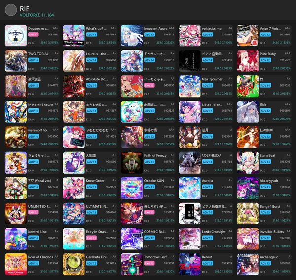

# Sound Voltex asphyxia Best50 Generator

> BEMANI 音乐游戏 **SOUND VOLTEX EXCEED GEAR / ∇** 的 Best 50 成绩卡片生成器。

从 [asphyxia](https://github.com/asphyxia-core) 存档中提取玩家成绩，按 **VOLFORCE** 降序取前 50 个不同谱面，生成 JPEG 格式 b50 和自包含 HTML。

## 预览



## 用法

### 1. 下载

从 [Releases](https://github.com/ChibaRie/sdvx_asphyxia_best_50/releases) 下载 `SDVX_B50.exe`。

### 2. 运行

将 `SDVX_B50.exe` 放到**游戏根目录**下（与 `asphyxia/`、`contents/` 同级），双击运行。

```
📁 KFC\
├── asphyxia\          ← 氧无服务端
├── contents\          ← 游戏资源（音乐、封面）
├── SDVX_B50.exe       ← 放这里，双击运行 ✨
└── b50_output\        ← 自动生成到这里
    ├── b50.jpg        # 卡片网格图（1200×~1135，~0.4MB）
    └── b50.html       # 自包含网页
```

### 3. 命令行高级用法

支持手动指定路径：

```
SDVX_B50.exe [存档路径] [曲目数据库路径] [音乐资源目录] [输出目录]
```

默认值：
- 存档：`./asphyxia/savedata/sdvx@asphyxia.db`
- MDB：`./asphyxia/plugins/sdvx@asphyxia/webui/asset/json/music_db.json`
- 音乐：`./contents/data/music`
- 输出：`./b50_output/`

## 输出格式

### JPEG 卡片网格

| 规格 | 值 |
|------|-----|
| 尺寸 | 1200 × ~1135 px |
| 格式 | JPEG（quality 85，optimize + progressive） |
| 体积 | ~0.4-1MB（原 PNG 5.2MB，缩减约 80%） |
| 布局 | 5 列 × 10 行横向卡片，**封面居左正方形（卡片宽 2/5）**，数据全部在右侧 |
| 信息 | 封面 / 曲名 / 难度标签(着色) / 分数 / EX SCORE / GRADE / VF·占比(4位小数) |
| 风格 | Clean Dark — 深灰背景 + 白色文字 |

### HTML 自包含网页

封面以 base64 内嵌，浏览器可直接打开、打印；表格含 `VF占比` 列。

## 新特性

- **VOLFORCE 贡献占比**：每张卡片右下角显示该曲对总 VOLFORCE 的贡献百分比（4 位小数），如 `250.0 ·12.3456%`；HTML 表格新增 `VF占比` 列。
- **横向卡片布局**：每曲一张 5:2 横向卡片，正方形封面居左、占卡片宽 2/5，标题/难度/分数/EX/VF 等数据全部在右侧呈现。
- **轻量 JPEG 输出**：保持 1200px 宽度，通过 JPEG（q85）+ 紧凑横向布局将体积从 5.2MB 降至约 0.4-1MB（缩减约 80%）。

## 项目架构

```
├── gen_b50.py          # 入口/编排：CLI 参数、路径解析、数据流水线
├── b50data.py          # 数据层：DB 解析、best50 选取、mdb 关联、封面定位、vf_pct 计算
├── render_png.py       # 渲染层：1200px 卡片网格 JPEG + 文字截断
├── render_html.py      # 渲染层：自包含 HTML
├── test_*.py           # pytest 测试（39 个）
├── msyh.ttc            # 微软雅黑字体（渲染中日韩文字，打包进 exe）
├── requirements.txt    # 依赖清单
├── SDVX_B50.spec       # PyInstaller 打包配置
├── CHANGELOG.md        # 更新日志
└── assets/             # 样本输出与预览图
    ├── b50.jpg         # 完整输出样本（1200×~1135 JPEG）
    └── preview_sm.jpg  # README 预览缩略图
```

### 数据流

```
asphyxia 存档 (.db) ─┐
music_db.json ───────┼→ b50data.py → render_png.py  → b50.jpg
contents 封面 ───────┘               └→ render_html.py → b50.html
```

## 工作原理

1. 读取氧无存档 `sdvx@asphyxia.db`（JSON 行格式）→ 提取所有 v7 成绩
2. 按 `(mid, type)` 去重，保留最高 VF
3. 按 VOLFORCE 降序取前 50 → 总分 = 前 50 VF 之和 ÷ 1000
4. 关联 `music_db.json` 获取曲名和难度等级
5. 从 `contents/data/music/` 定位封面图片
6. 渲染卡片网格 JPEG + 自包含 HTML；每曲标注其 VF 占总 VF 的贡献占比（4 位小数）

## 从源码构建

```bash
# 1. 创建精简 venv
python -m venv build_venv
source build_venv/Scripts/activate  # Windows
# source build_venv/bin/activate    # Linux

# 2. 安装依赖
pip install -r requirements.txt pyinstaller

# 3. 打包
pyinstaller SDVX_B50.spec

# 4. 输出: dist/SDVX_B50.exe (~27MB)
```

## 相关项目

- [asphyxia-core](https://github.com/asphyxia-core/core) — 游戏本地服务器
- [sdvx@asphyxia](https://github.com/22vv0/asphyxia_plugins) — SDVX 插件
